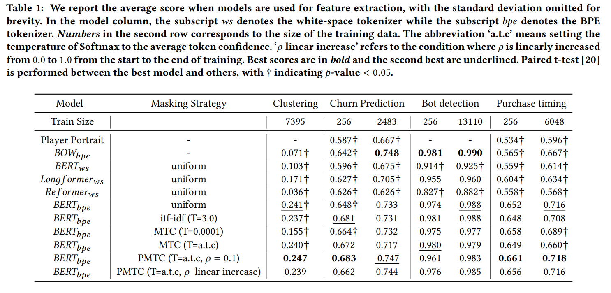
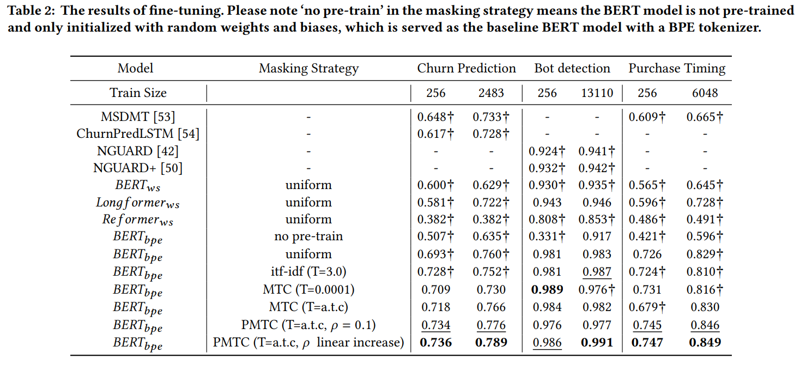

## [2020]Unsupervised Representation Learning of Player Behavioral Data with Confidence Guided Masking

## 内容サマリ
Encoderを用いて、プレイヤーの行動seqenceを固定長のベクトルにエンコードする。
マスキングの際に、マスクする対象をconfidence結果を見て変更していくところに新規性がある。

下流のタスクでは、task-specificなモデルよりも良い成果を出せている。

## Intro
### 問題設定
行動シークエンス$S =(e_{1}, o_{1}, ..., e_{l/2}, o_{l/2})$, $e_{l/2}$はイベントid, $o_{l/2}$はオブジェクトid
に対して、encoder $f_{\theta}:S \rightarrow R$となるようなエンコーダーを得ることを目的にする。
得られたベクトルはプレイヤーの行動シークエンスを代表していて、様々な下流のタスクに利用できることが好ましい。

## Model
### BPE
BPE(bite pair encoding)はシークエンス圧縮の手法である。
連続する二文字の中で、最も頻度が高いものを一文字で置き換えることにより、
シークエンス長を圧縮する。
内容は下記参照
https://aclanthology.org/2020.findings-emnlp.414.pdf

今回は、イベント/オブジェクトのペアを一文字とみなしてBPEを適用し、
より短いシークエンス$T = (t_{1}, ..., t_{q})$を得る。

### 言語モデル
BERTを用いる。

### Pre-training task
MLMを用いる。
15パーセントのトークンをマスクする。
80パーセントのトークンは[MASK], 10パーセントはそのまま、残りの10パーセントはランダムなイベントで置換し、それらの予測確率の対数尤度を最大化することを目的にする。

#### masking strategy
15パーセントのマスキング対象をどのように選ぶかは以下の3通りの方法を試した。

■masking uniformly
すべての単語に対して0.15パーセントの確率でマスキングされるように設定する。

■masking by ITF-IDF
シークエンス内で頻度が低いイベントまたは全体的にみて頻度が低いイベントを優先的にマスクするように設計。

$itf =\frac{全単語の出現頻度の和}{あるシークエンスに於けるイベントiの頻度}$ 
$idf =log(\frac{全シークエンス数}{あるイベントiを含むシークエンスの数})$ 
$Softmax(x_{i}, T) = \frac{exp(x_{i}/T)}{\sum_{j} exp(x_{j}/T)}$
$p^{itfidf}_{i} = Softmax(itf_{i}idf_{i}, T)* 0.15 * l$

■Masking by Token Confidence(MTC)
マスクするトークンの種類を予測confidenceによって決定する。
各エポックごとに、ベクトルtrを以下のように更新する。
　$tr^{t} = [\bar{f_{\theta}(s_{1} | S)}, ..,\bar{f_{\theta}(s_{j} | S)}]$
　$tr_{B} = (1 - \alpha)*tr_{B} + \alpha * tr^{t}$
これをもちいて、マスク確率を以下のように計算する
　$p^{m}_{i} = Softmax(1 - tr(s_{i}), T)*\beta * l$
 
またTに関しては以下のように計算する。
$T = (\sum^{v}_{i=1}tr_{i})/v$

 ■Partially masking by Token Confidence
 uniformを使うかMTCを使うかbatchごとにランダムに決める

## 下流のタスク
BOT検知
解約予測
課金タイミング予測
類似プレイヤーの推測

上記3タスクはcross entroy, 類似プレイヤに関してはクラスタリングを用いた。

##　結果

BERTモデルはその他のEncoderと比べてもいい成果を出せている。
（これならBOWの方がよくない？って見方もありそう。）

BERTモデルはtask-specificなモデルと比べてもよい成果を出せている。
